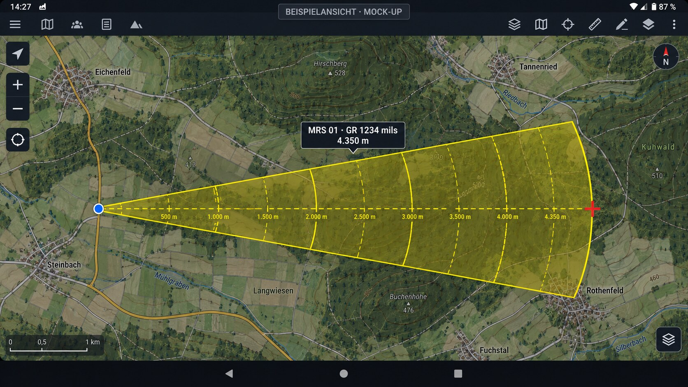
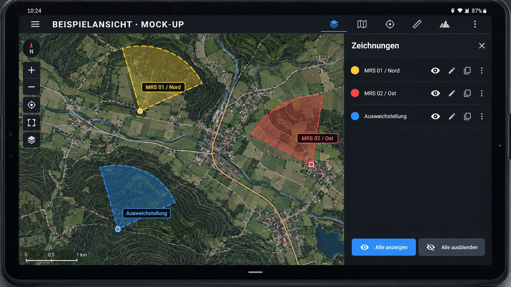
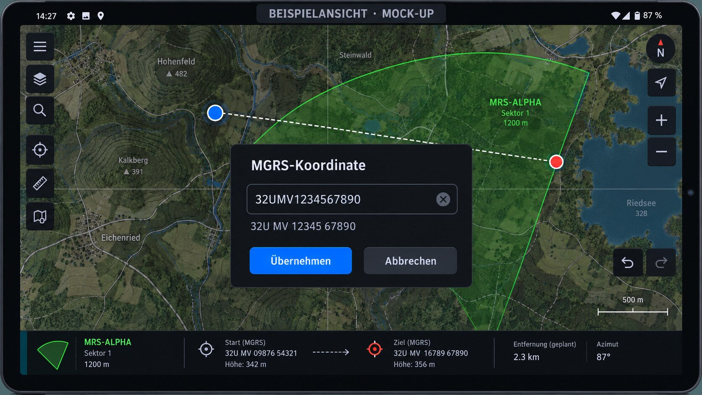

# Jarnsen Mrs Plugin

ATAK-CIV Plugin für eine einfache Mörser-/Richtungsdarstellung zwischen einem
frei gewählten Start- und Zielpunkt.

## Aktueller Stand

Version **0.4.0** baut den persistenten Arbeitsbereich aus 0.3.0 zu einer
komfortableren und robusteren Mehrzeichnungs-Verwaltung aus. Zeichnungen bleiben nach einem ATAK-Neustart erhalten,
können direkt auf der Karte geöffnet, dupliziert, bearbeitet und entfernt werden.
Start und Ziel können per Karte, MGRS oder Breite/Länge gesetzt werden. Für
bestehende Zeichnungen stehen direkte Drag-Griffe sowie Rückgängig/Wiederholen
zur Verfügung.

## Funktionen im Überblick

- **Start und Ziel flexibel setzen:** eigene Position, ATAK-Marker, Kartenpunkt,
  MGRS oder Breite/Länge.
- **Sofortige Kartendarstellung:** Mittellinie, Grundrichtung in Gitternord,
  Sektorgrenzen, Zielkreuz und Entfernungsbögen.
- **Feste MRS-Geometrie:** ±600 Strich um die Mittellinie, maximal 8 km Tiefe,
  Bögen alle 500 m und verstärkte volle Kilometer.
- **Mehrere Zeichnungen verwalten:** benennen, duplizieren, bearbeiten,
  ein-/ausblenden und löschen.
- **Darstellung je Zeichnung anpassen:** Farbe, Transparenz, 500-m-Bögen,
  1-km-Bögen, Beschriftungen, Klammer, Zielkreuz und Sektorfüllung.
- **Direkt auf der Karte bearbeiten:** Start- und Zielgriff ziehen, Live-Vorschau
  sehen und Änderungen mit Rückgängig/Wiederholen korrigieren.
- **Dynamische Bezugspunkte:** Bei eigener Position oder einem beweglichen
  ATAK-Marker wird die Zeichnung automatisch neu berechnet.
- **Dauerhafte Arbeitsstände:** Zeichnungen und bis zu zehn Undo-/Redo-Zustände
  bleiben nach einem ATAK-Neustart erhalten.
- **Datenaustausch und Diagnose:** JSON-Import/-Export sowie Diagnoseausgabe mit
  Plugin-Version, Zertifikat, Cache- und Zeichnungsstatus.

## Realistische Einsatzbeispiele

> Die folgenden Bilder sind realistische **Beispielansichten / Mock-ups** mit
> fiktiven Kartendaten. Sie zeigen den vorgesehenen Funktionsablauf und sind
> keine unveränderten Bildschirmfotos aus einem realen Einsatz.

### Sektoransicht



*Beispielansicht: Ein Sektor mit Grundrichtung, 500-m-Bögen und Zielpunkt.*

### Mehrere Zeichnungen verwalten



*Beispielansicht: Drei vorbereitete Zeichnungen mit Farbe, Sichtbarkeit und Direktaktionen.*

### MGRS-Eingabe und Punktbearbeitung



*Beispielansicht: MGRS-Vorschau, Übernahme und direkte Start-/Zielgriffe.*


### Beispiel 1 – Fester Startpunkt und Ziel auf der Karte

1. **Neue Zeichnung** öffnen und beispielsweise **MRS 01** nennen.
2. Den bekannten Standort als Startpunkt auf der Karte setzen.
3. Einen vorhandenen ATAK-Zielmarker als Ziel auswählen.
4. ATAK zeigt unmittelbar die Mittellinie, die berechnete Grundrichtung in
   NATO-Strich, die Entfernung zum Ziel und den vollständigen 8-km-Sektor.
5. Die 500-m- und 1-km-Bögen helfen dabei, Entfernungen auf der Karte schnell
   räumlich einzuordnen.

Eine mögliche Anzeige lautet zum Beispiel **MRS 01 – GR 1234 mils** und
**Entfernung 4.350 m**. Das sind nur Beispielwerte; Richtung und Entfernung
werden immer aus den tatsächlich gewählten Punkten berechnet.

### Beispiel 2 – Beweglicher Bezugspunkt

Als Start kann **Eigene Position** verwendet werden. Wird anschließend ein
beweglicher ATAK-Marker als Ziel gewählt, folgt die Zeichnung den
Positionsänderungen: Grundrichtung, Mittellinie und Entfernung werden
automatisch aktualisiert. Dadurch muss die Darstellung bei einer
Lageänderung nicht vollständig neu angelegt werden.

### Beispiel 3 – Mehrere vorbereitete Räume

Für verschiedene Aufträge können mehrere Zeichnungen parallel gespeichert
werden, zum Beispiel:

- **MRS 01 / Nord** in Gelb
- **MRS 02 / Ost** in Rot
- **Ausweichstellung** in Blau

Nicht benötigte Zeichnungen lassen sich einzeln oder mit **Alle ausblenden**
aus der Karte nehmen und später wieder einblenden. Eine bestehende Zeichnung
kann dupliziert und anschließend über die farbigen Start-/Zielgriffe angepasst
werden.

### Beispiel 4 – Koordinate übernehmen

Eine kompakte Eingabe wie `32UMV1234567890` wird erkannt und vor dem
Übernehmen in eine lesbare MGRS-Schreibweise gebracht. So kann eine über Funk
oder Chat erhaltene Koordinate schnell geprüft und als Start oder Ziel
verwendet werden.

> **Wichtig:** Das Plugin ist eine Karten- und Planungsdarstellung. Es ersetzt
> keine Feuerleit- oder Ballistiksoftware und berechnet weder Ladung,
> Rohrerhöhung, Wetter-/Munitionskorrekturen noch Sicherheitsfreigaben.

### Bedienung

1. In ATAK das Werkzeug **Jarnsen Mrs Plugin** antippen.
2. Den Startpunkt wählen: **Eigene Position**, **Koordinaten eingeben** oder
   **Auf der Karte wählen**.
3. Den Zielpunkt auf die gleiche Weise wählen.
   Bei **Auf der Karte wählen** wird die Darstellung bereits beim Berühren
   aufgebaut, beim Ziehen live nachgeführt und erst beim Loslassen festgelegt.
4. Das Plugin zeichnet den Sektor vom gewählten Start zum gewählten Ziel.
5. Optional eine Sektorfarbe auswählen: **Weiß, Rot, Gelb, Blau, Grün** oder
   **Schwarz**. Mit **Standard** oder durch Schließen der Auswahl bleibt
   die bisherige Standardfarbe erhalten.
6. Wird die eigene Position oder ein beweglicher ATAK-Marker verwendet, wird
   die Darstellung bei Positionsänderungen automatisch neu berechnet.
7. Die eingezeichnete Darstellung oder das Plugin-Symbol antippen. Im Menü kann
   sie **Bearbeitet** (Start und Ziel neu wählen) oder **Entfernt** werden.

## Darstellung

- Mittellinie: ausgewählter Startpunkt → ausgewähltes Ziel
- Richtung: **Gitternord**
- Winkelmaß: **NATO 6400 Strich**
- Sektor: **±600 Strich** um die Mittellinie
- maximale Sektorreichtiefe: **8 km**
- Entfernungsbögen alle **500 m**
- 500-m-Zwischenbögen: dünner / gestrichelt
- volle Kilometer: stärker / durchgezogen
- optionale transparente Sektorschattierung in Weiß, Rot, Gelb, Blau, Grün
  oder Schwarz
- Entfernungsbeschriftungen liegen jeweils auf der eigenen Seite vor dem
  zugehörigen Bogen
- genau **eine** zentrale, um 90° gedrehte `)(`-Klammer in der Mitte der
  Ziellinie
- an der Klammer:
  - oben: Bezeichnung und Grundrichtung als **MRS 01  GR xxxx mils**
  - unten: tatsächliche Entfernung zum Ziel in Metern
- rotes Zielkreuz ohne dauerhafte Zielbeschriftung
- beim Antippen der Darstellung wird die Zielkoordinate in **MGRS** angezeigt

## Gitternord

Die Karten-Geometrie wird mit dem geodätischen True-Bearing gezeichnet. Für die
angezeigte Richtung wird ATAKs eigene Grid-Convergence-Berechnung verwendet:

`Grid Bearing = True Bearing - Grid Convergence`

Danach erfolgt die Umrechnung:

`Strich = Grad × 6400 / 360`

Damit bleibt die Linie geometrisch korrekt, während die Richtungsangabe als
Gitternord/Strich ausgegeben wird.

## Technische Basis

Das Projekt orientiert sich an der offiziellen ATAK-Plugin-Struktur und ist
aktuell für **ATAK-CIV 5.6.0** konfiguriert.

Paket/Namespace:

`com.jarnsen.atak.mrs.plugin`

## Bauen

Zum Bauen wird das offizielle ATAK Plugin DevKit benötigt.

### Variante A – lokale DevKit-Datei

Die Datei `atak-gradle-takdev.jar` aus dem passenden ATAK DevKit in das
Repository-Hauptverzeichnis legen. Die Datei ist absichtlich in `.gitignore`
eingetragen.

### Variante B – TAK Maven Repository

In `local.properties` einen verfügbaren TAK-Repository-Zugang konfigurieren:

```properties
takrepo.url=...
takrepo.user=...
takrepo.password=...
```

Danach kann das Projekt in Android Studio geöffnet bzw. mit einer passenden
Gradle-Installation gebaut werden.

## Projektstruktur

- `JarnsenMrsLifecycle` – Plugin-Lifecycle
- `JarnsenMrsPluginTool` – ATAK-Toolbar-Eintrag
- `JarnsenMrsMapComponent` – Initialisierung und Overlay-Gruppe
- `JarnsenMrsSectorTool` – Zielauswahl, Gitternord-Berechnung und komplette
  Sektor-Geometrie
- `docs/GEOMETRY.md` – feste Geometrie und Berechnung

## Noch bewusst fest eingestellt

Die maximale Sektorreichtiefe bleibt fest auf **8 km**. Andere
Darstellungsoptionen werden pro Zeichnung verwaltet.


## CI-Build für ATAK 5.6.0

Die GitHub-Action baut das Plugin mit `ATAK_VERSION = 5.6.0`.

Da zum aktuellen öffentlichen ATAK-CIV-Quellstand noch kein vollständiges
binäres 5.6.0-SDK als Release-Artefakt veröffentlicht ist, erzeugt CI den
aktuellen `atak-gradle-takdev` direkt aus dem offiziellen ATAK-CIV-5.6-Quellstand
und verwendet daraus außerdem Signierschlüssel und Core-Proguard-Regeln.

Der ältere öffentliche `main.jar` aus dem 5.5.1.8-SDK wird ausschließlich als
Compile-Stub verwendet. Die vom Plugin verwendeten ATAK-APIs wurden zusätzlich
gegen den offiziellen 5.6.0-Quellstand geprüft. Zur Laufzeit liefert ATAK 5.6.0
die tatsächlichen Core-Klassen.


## Version 0.4.0

- neue Zeichnungsverwaltung mit Sichtbarkeit, Farbe und Direktaktionen je
  Zeichnung
- **Alle anzeigen / Alle ausblenden**
- aktive Zeichnung wird beim Öffnen/Bearbeiten optisch hervorgehoben
- größere, farbige Start-/Ziel-Drag-Griffe mit zusätzlicher Drag-Rückmeldung
- kompakte MGRS-Eingaben wie `32UMV1234567890` werden automatisch
  kanonisch formatiert
- MGRS-Dialog zeigt die erkannte Koordinate bereits vor dem Übernehmen
- JSON-Export und -Import unter `atak/tools/jarnsen-mrs`
- automatische Sicherung des letzten gültigen Zeichnungsstands
- Undo/Redo wird mit bis zu 10 Zuständen über ATAK-Neustarts erhalten
- statische Sektor-Geometrie wird gecacht; Zoom-/UI-Neuzeichnungen müssen die
  500-m-/1-km-Bögen nicht jedes Mal vollständig neu berechnen
- Diagnose kann kopiert oder als Textdatei exportiert werden
- Diagnose zeigt zusätzlich Cache-Statistik, Sichtbarkeitsstatus und das
  tatsächliche Plugin-Zertifikat
- optionale GitHub-Release-Prüfung; bei einem nicht öffentlich erreichbaren
  Repository bleibt die automatische Prüfung still und die manuelle Prüfung
  meldet den Grund
- automatisierte JVM-Regressionstests für MGRS, feste ±600-Strich-/8-km-
  Geometrie, Persistenz-Codec, Undo/Redo und Versionsvergleich
- maximale Sektorreichtiefe bleibt **fest bei 8 km**

## Version 0.3.0

- mehrere gleichzeitig sichtbare, persistent gespeicherte Mrs-Zeichnungen
- direktes Antippen der Darstellung für Schnellaktionen
- direkte Drag-Griffe für Start und Ziel
- Live-Vorschau beim Ziehen vor dem Loslassen, auch bei Marker-Drag-Events
- MGRS-Eingabe mit Zwischenablage, Sofortprüfung und letzter Eingabe
- Rückgängig/Wiederholen
- Duplizieren, Bearbeiten und Löschen
- per Zeichnung ein-/ausblendbar: 500-m-Bögen, 1-km-Bögen,
  Entfernungsbeschriftungen, Klammer, Zielkreuz und Sektorfüllung
- einstellbare Transparenz der Sektorfüllung
- zoomadaptive Pfeil-, Zielkreuz-, Klammer- und Tick-Geometrie
- Diagnoseansicht mit ATAK-/Plugin-Version, Signaturstatus, Zeichnungszahl,
  Undo/Redo-Stand und letzter fehlerhafter Eingabe
- maximale Sektorreichtiefe bleibt bewusst **fest bei 8 km**

